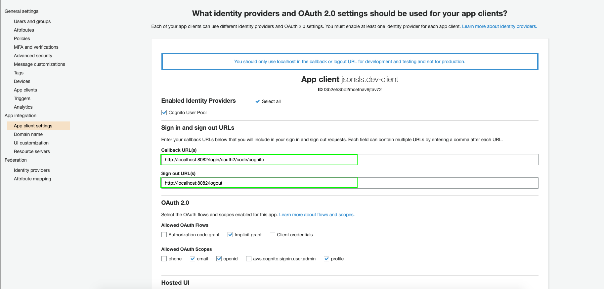
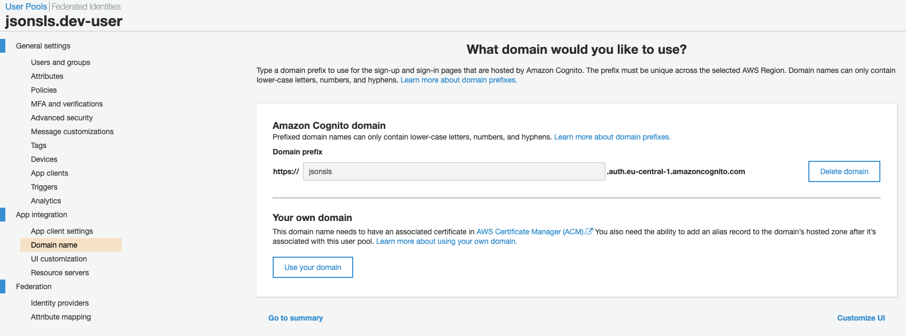

# JSON-Serverless Cognito Vue Example

> More information to json-serverless (https://github.com/pharindoko/json-serverless)

This is a full example that shows how you can extend json-serverless as backend with Cognito for Auth and Vue as Client App.

## Details:

- shows how to add cognito as authentication middleware for json-serverless
  - data is only accessible with the idtoken in authorization header
- shows how to request data via REST from json-serverless
- shows how to switch between S3 and Local FileAdapter

## Installation

1. install

   ```bash
   npm i #installs concurrently (see package.json`s scripts)
   ```

   install backend

   ```bash
   cd backend && npm i #installs backend`s node_modules
   ```

   install frontend

   ```bash
   cd frontend && npm i #installs frontend`s node_modules
   ```

## Deployment

Deploy the backend once in AWS (**mind:** this works only with your aws credentials)

> this is meant to create the Resources mentionend in serverless.yml (CognitoPool + S3Bucket)

- build the app

  ```
  cd backend
  npm run build
  ```

- deploy

  ```bash
  sls deploy
  ```

* configure

  After sucessful deployment please login into AWS Console and configure AWS Cognito settings.
  **Mind**: Will be deployed in us-east-1 region (N. Virginia) - see backend/serverless.yml file for more information
  The Cognito Client Domain needs to be created and used later in the frontend to make a call against.

  - Configure App Client Settings:

  

  - Configure DomainName:

  

## Frontend Configuration

1. Go to file frontend/.env
2. Alter following configuration parameters

   > You can get these settings from the aws console. (https://console.aws.amazon.com/cognito)

   ```bash
   VUE_APP_COGNITO_USERPOOL_ID=us-east-_1_xxxxxxx_
   VUE_APP_COGNITO_APP_DOMAIN=cognito-url-aws.com
   VUE_APP_COGNITO_CLIENT_ID=xxxxxxxxxxxxxxxxxxxx
   ```

## Start and Develop Locally

- ensure you are in the root directory of the repo
- start the frontend and backend (via sls offline)

  ```
  npm run start
  ```

  > the frontend supports hot-reload via vue-cli

  > for the backend part you need to re-run in case of changes (didn`t implement any reload mechanism).

### Usage

Frontend:

1. Open http://localhost:8082
2. You need to Sign up first in your Cognito App
3. Validate your account (mail for verification)
4. You should see a list with items of datagov

Backend:

1. Open http://localhost:3000/ui to see the swagger interface

## Start with the api in the cloud

1. Go to file frontend/.env
2. Alter the configuration parameters

   > Adapt variable VUE_APP_JSONSLS_ENDPOINT - use the apigateway endpoint

   ```bash
   VUE_APP_JSONSLS_ENDPOINT=https://xxxxxxx.execute-api.us-east-1.amazonaws.com/dev
   ```

   > how to get the api gateway endpoint ?  
   > go to the backend and type 'sls info'

3. Start only the frontend (backend not need)

   ```
   cd frontend
   npm run serve
   ```

## How to add authentication

see backend/handler.ts file

```javascript
const cognitoExpress = new CognitoExpress({
  region: process.env.region,
  cognitoUserPoolId: process.env.COGNITO_USER_POOL_ID,
  tokenUse: "id",
  tokenExpiration: 3600000,
});

server.use((req: any, res: any, next: any) => {

...
...

  // if httpverb of request is not OPTION and GET and request url startsWith "api" - Authenticate
  // ui and graphql interface are reachable - but no post or modification can be made directly without
  // having headerentry key:authorization: value: idtoken (cognito)
  if (
    req.method !== "OPTIONS" &&
    req.method !== "GET" &&
    req.url.startsWith("/api")
  ) {
    let accessTokenFromClient = req.headers["authorization"];
    if (!accessTokenFromClient)
      return res.status(401).send("Access Token missing from header");
    cognitoExpress.validate(accessTokenFromClient, function (
      err: any,
      response: any
    ) {
      if (err) return res.status(401).send(err);
      else next();
    });
  } else {
    next();
  }
});
```
